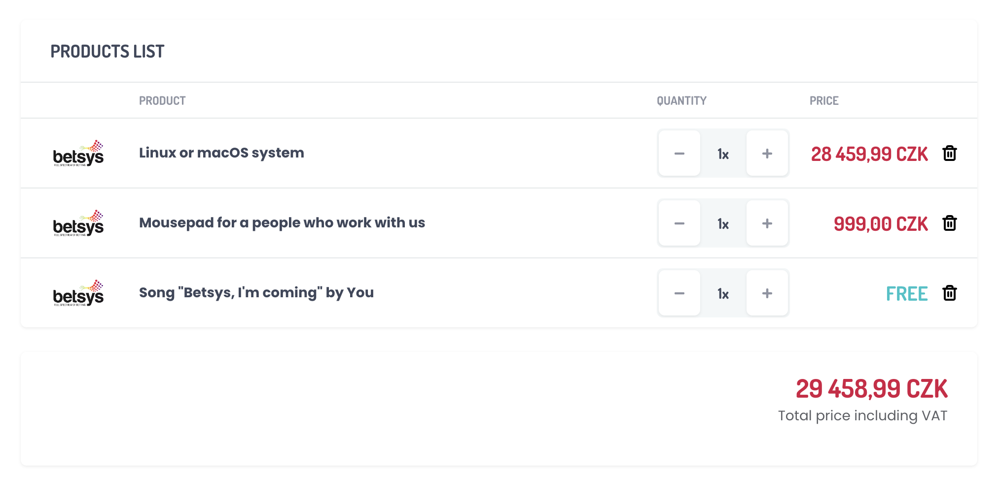

# Products List

Your goal is to create a list of products using the latest versions of Angular and NgRx.
Your code should be validated by writing the unit tests. You can use any of the testing frameworks.



*Image above is only an example of how the list can look like* 

### Requirements

- **Duration**: max. 2 days
- **Technology stack**: Angular, NgRx, RxJS, TypeScript, HTML, SCSS/CSS
- **Tests required**: Unit tests (any framework)
- **Design**: You can use any design you want.
- **Other**: Use any libraries you need for styling, working with HTML, etc.
- **Standards**: Follow the best practices and standards you know.
- **Git**: Use Git to track your changes. You can use any Git hosting service you want. Try to commit often and use meaningful commit messages.
- **Want to feel like working in Betsys?**: 
  - Use [Conventional Commits specification](https://www.conventionalcommits.org/en/v1.0.0/) to track your changes
  - Use [Jest](https://jestjs.io/) as a testing framework
  - Use [SASS with SCSS syntax](https://sass-lang.com/) as a CSS preprocessor

:warning: You need to use **[NgRx Store](https://ngrx.io/guide/store)** for state management. Feel free to also use any other libraries from ngrx (e.g. effects)

### Task description

- listing should display the image, name, quantity and the price of each product
  - image has no standard size, so you should use tricks to make it look good anyway
  - name should be displayed in title-case
  - quantity can be changed by clicking on the +/- buttons
  - if quantity is changed to 0, the product should be removed from the list
  - price should be calculated based on the quantity of that product
  - price should be displayed in the currency format (e.g. 1 000,00 CZK)
  - each product can be deleted by clicking on the delete icon button
- there should be a total price of all products under the listing (also in the currency format)
- in case all the products are deleted, the listing should display a message "No products"

### Testing
Unit tests need to cover the "business logic" of the application (styles/texts are not that important).
You can use any of the testing frameworks. We mostly use Jest internally, though.

### API
Please, mock the API using a file, hardcoded data or any other way you like.
Don't worry about the removal of the products, it can be done locally.

**Example of mocked data** *(feel free to use anything else)*:<br>
```json
[
  {
    "id": 1,
    "name": "Product 1",
    "price": 1001.59,
    "image": "https://via.placeholder.com/150",
    "quantity": 1
  },
  {
    "id": 2,
    "name": "Product 2",
    "price": 2099.99,
    "image": "https://via.placeholder.com/150",
    "quantity": 2
  }
]
```
