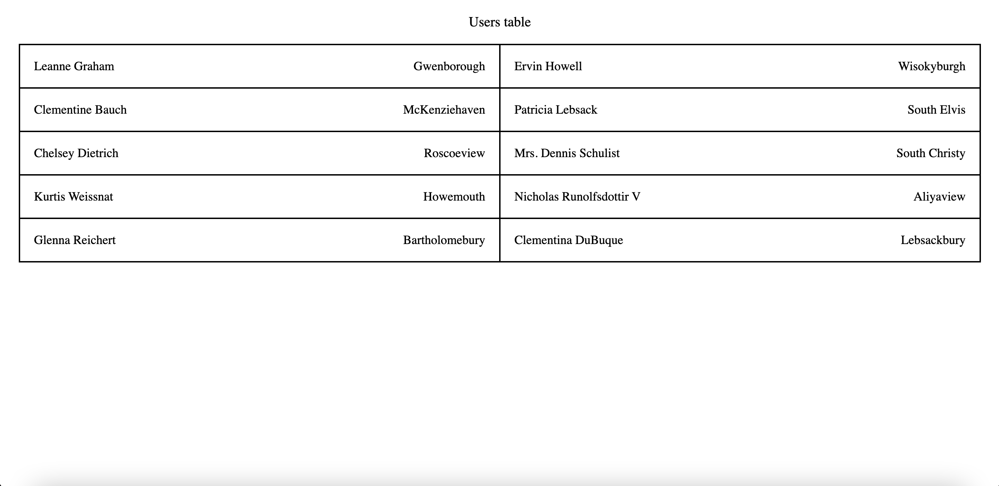

# Users List

Your goal is to create a table with users using the latest versions of Angular and NgRx.
Your code should be validated by writing the unit tests. You can use any of the testing frameworks.

### Requirements

- **Technology stack**: Angular, NgRx, RxJS, TypeScript, HTML, SCSS/CSS
- **Tests required**: Unit tests (any framework)
- **Standards**: Follow the best practices and standards you know.
- **Git**: Use Git to track your changes. You can use any Git hosting service you want. Try to commit often and use meaningful commit messages.
- **Want to feel like working in Betsys?**: 
  - Use [Conventional Commits specification](https://www.conventionalcommits.org/en/v1.0.0/) to track your changes
  - Use [Jest](https://jestjs.io/) as a testing framework
  - Use [SASS with SCSS syntax](https://sass-lang.com/) as a CSS preprocessor
  - Use [Betsys Coding Standards](https://github.com/betsys-com/betsys-eslint) for ESLint

:warning: You need to use **[NgRx Store](https://ngrx.io/guide/store)** for state management. Feel free to also use any other libraries from ngrx (e.g. effects)

### Task description

- Show `name` and `city` of 10 users from endpoint `https://jsonplaceholder.typicode.com/users` inside table
- use `NgRx`
  - load users by dispatching action from component
  - store users into `UsersState`
  - use selector to get users from store
  - for users table crete component which receives users as `@Input` and shows them as a table with 2 columns like on design (design of table can be found in `/todo/visual.png`)

### Testing
Unit tests need to cover the "business logic" of the application (styles/texts are not that important).
You can use any of the testing frameworks. We mostly use Jest internally, though.
